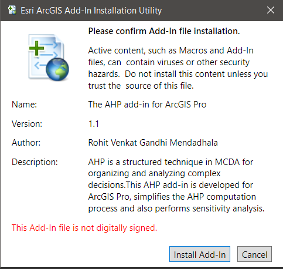
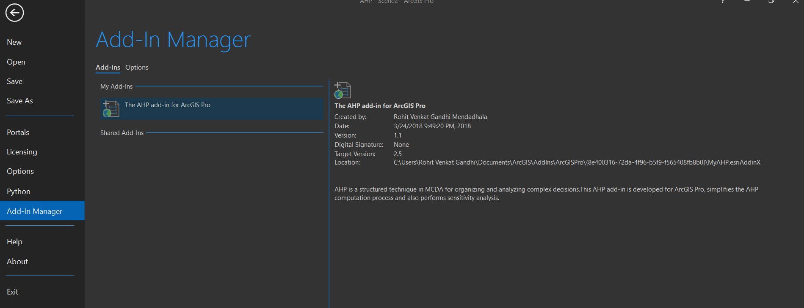
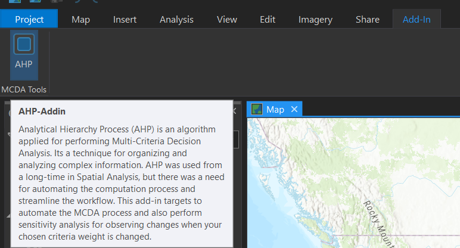
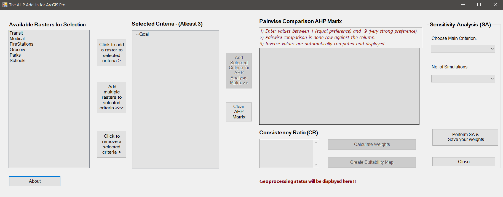

## Automating Multi Criteria Decision Analysis in GIS

## Theme:Add-in Application Development for choosing sites for housing based on accessibility levels.

### Table of Contents

- [MCDA Introduction](#MCDA-Intro)
- [AHP Introduction and ArcGIS Pro Integration](#AHP-Intro-and-ArcGIS-Pro-Integration)
- [Installation](#Installation-Process)
- [Considerations](#Some-Important-Considerations)
- [Implementation and Workflow](#implementation-and-workflow)
  - [Data Preparation Stage](#data-preparation-stage)
  - [AHP Algorithm Implementation](#ahp-algorithm-implementation)
  - [Sensitivity Analysis](#sensitivity-analysis)
- [How to use this add-in for your workflow](#how-to-incorporate-this-addin-to-your-workflow)
- [Documentation and Presentation](#Documentation-Presentation-AddinDemo)
- [Contributions/Improvements/Bugs](#Contributions-Improvements-Bugs)

### MCDA Intro:

Multi-Criteria decision analysis is one of the most powerful technique in evaluating and comparing multiple criteria for arriving at a solution. MCDA can also applied in Geospatial world for making some crucial location based decisions. As a part of this project, I have used MCDA for choosing sites for the housing development based on accessibility levels to basic facilities like Grocery Stores, Medical Facilities, Fire Stations, Schools, Parks, Transit Stations.

### AHP Intro and ArcGIS Pro Integration:

In MCDA, One of the first algorithm introduced in MCDA was Analytical Hierarchy Process (AHP) by Thomas Saaty in 1980.Since the AHP algorithm involves several matrix computations which can be laborious without excel, I have developed this add-in which can be integrated with ArcGIS Pro and run for making analysis.

### Installation Process:

Clone/download the repo and look for MyAHP.esriAddinX and double click on it for installation.

</img>

The add-in should be in installed in "C:\Users\{username}\Documents\ArcGIS\AddIns\
This should add the add-in and make an Add-in tab in your ArcGIS Pro.

Once the add-in is installed, it should show up in your ArcGIS Pro Add-in Manager.

When you navigate to ArcGIS Pro add-in tab at the top

Click on the Add-in and you see the following screenshot

Note that the raster layers may differ depending on what are open in your project.
Only those raster layers which are active (visible and checked) in the Table of contents will be ready for analysis.

### Requirements:

- ArcGIS Pro 2.5
- .Net Target Framework 4.8
- Visual Studio 2017 or 2019

### Some Important Considerations:

When we are performing MCDA in GIS, since we are comparing various criteria it is often better to use the Feature/Raster Layers on a uniform scale rather than a varying scale. Hence normalization is performed (ex: 0 to 1 , 1 to 100). In order to minimize the manual intervention of the user with default geoprocessing tools in ArcGIS Pro, we have integrated these reclassification values into the code which can be changed as per your normalization scale. For this project, the normalization scale is chosen as (0 to 1) for the raster layers and also when performing raster reclassification the following ranges were considered which again can be customized in the code again as per user requirements.

- 0-0.6 -> 1 (Less Suitable)
- 0.6-0.8 -> 2 (Moderately Suitable)
- 0.8-1 -> 3 (Highly Suitable)

### Implementation and Workflow:

At a high level overview the workflow is divided into three stages namely data preparation, AHP algorithm implementation, Sensitivity Analysis

#### Data Preparation Stage:

- Eucledian distance rasters were generated from the criteria feature classes (Transit,Medical..etc)
- Normalization of these rasters was performed using Raster Calculator (0 to 1)
- Since we have 6 rasters to perform this functionality on, we have utilized model builder/python arcpy module to automate this entire process.
- The normalized rasters were feeded as inputs to the AHP-addin

#### AHP Algorithm implementation:

- AHP pairwise comparison is performed with chosen criteria.
- The weights and consistency ratio (CR) is calculated.
- Using these weights internally weighted sum and raster reclassification is done.
- Suitability Map is generated for the base run with your reclassified values.
- Here it would 1, 2 and 3 as described in the considerations section.

#### Sensitivity Analysis:

Sensitivity Analysis is a powerful alternative for incorporating uncertainities into decision making process. It showcases the impact of changing criteria weights on the resultant output from model in spatial dimension.

- To perform sensitivity analysis, we choose a main criterion and then number of simulations.
- The main criterion weight is increased/decreased as per number of simulations
- For example if 4 simulations are chosen, we compute 1% increase, 1% decrease, 2% increase, 2% decrease on the actual weight of the main criterion.
- The remaining criterion weights are adjusted accordingly to sum up these weights to be 1.
- Finally save your weights and perform change detection in your suitability area.

### How to incorporate this addin to your workflow?

- Decide on your theme for applying AHP.
- Decide the normalization scale for your rasters before feeding in.
- Decide the reclassification values for your rasters.
- Decide the number of simulations to be performed (In this project 2,4,8,10 are provided)
- Edit the reclassification values and simulations as per your requirements in the code.

### Documentation-Presentation-AddinDemo

- For better understanding of this project, please review the AHP algorithm, process and computation methodology. In addition, feel free to explore the documentation and presentation of this project in the docs folder.

<a href="https://www.youtube.com/watch?v=mV2inNIBkMI" target="_blank">View AHP-Addin Demo here</a>

The screenshots shown may be slightly different from the demo, as the demo was made with version 1.0

### Contributions-Improvements-Bugs

Feel free to report any bugs you encounter while using this add-in. If you are interested in optimizing the code-base for this add-in and make it better in terms performance, please contact me at rvg296@gmail.com, so I can add you to the contributor list for collaboration. Any pull requests are reviewed carefully and suggestions are accepted.
